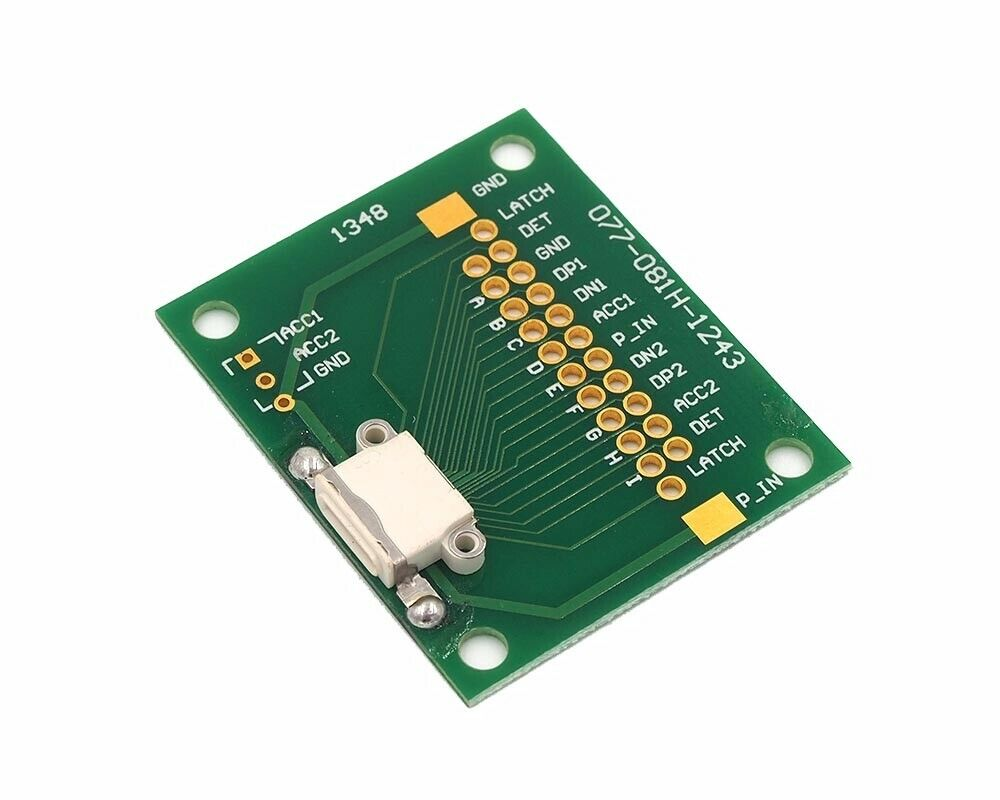

# Lightning IDBUS Applications
This page will provide some fundamental information how we can produce IDBUS message and emulate the HIFIVE and TRISTAR chip. These two chips communicate via the IDBUS protocol, which is a single wire protocol and operates as the followers:


The HIFIVE chip is part of the Lightning connector and the TRISTAR is build into Apple device. The protocol is used to map internal device protocols such as USB, JTAG and UART to the Lightning pins. Furthermore, IDBUS is exchanged via either the ID0 or ID1 pin. Which pin is used depends on the rotation of the male plug.


As we can see, the protocol exchanges the message via the request response pattern, where each message consist of an header + data + CRC value. Because the protocol does not have any clock line, the information is statically encoded in the high and low periods. As we can see, a `0` corresponds to a long low and a short high period. Conversely, a `1` is encoded via a short low and a long high period. Besides the logical `0` and `1`, also other message such as a `BREAK`, `WAKE` and `STOP` are available. Where the `BREAK` is only send by TRISTAR and flags the start and end of an message. A `STOP` is send by both chips and signals the end of a byte. `WAKE` is only send by HIFIVE and signals a reinitialization. 

## PowerHandshake
https://www.electronics-tutorials.ws/transistor/tran_4.html
https://electronics.stackexchange.com/questions/248796/pnp-high-side-transistor-switching-with-microcontroller

## Communication
The IDBUS communication is enabled by the `idbus_io` library; more information about it can be found [here](./idbus_io/). The library allows us to exchange IDBUS message similar as we would access a normal file on Linux.

## Utilities
For assembling the below listed applications, we have used the following breakout boards:

### AZ-Delivery LogicAnalyzer
* [amazon](https://www.amazon.de/AZDelivery-%E2%AD%90%E2%AD%90%E2%AD%90%E2%AD%90%E2%AD%90-Logic-Analyzer-gratis/dp/B01MUFRHQ2/ref=sr_1_3?keywords=az+delivery+logic+analyzer&qid=1668523993&sprefix=az+delivery+logic%2Caps%2C103&sr=8-3)
* 
* Software: [Saleae Logic2](https://www.saleae.com/downloads/)
* AnalyzerPlugin: [SDQAnalyzer](https://github.com/nezza/SDQAnalyzer)
  
### Raspberry Pi Pico
* [mouser](https://www.mouser.at/ProductDetail/Seeed-Studio/102110537?qs=pUKx8fyJudDPj27tABVsxg%3D%3D)
* 
* [Datasheet](./../../library/datasheets/rp2040-datasheet.pdf)

### Lightning
* [ebay](https://www.ebay.com/itm/303388249356?hash=item46a3594d0c:g:y6wAAOSwpz9d5eDw&amdata=enc%3AAQAHAAAAoAP2R%2F0bNceQvU3IBZ%2B6tW14WkgFCP91EvCVCq6uVejRoK4A9UAbs14cUKH7Mp3FL%2BY0FmSyqTk2VXkwmg%2Fa2hVqNnb8MbriBfEbcuas5hdnLbsayU6ou0%2FGYIHfc2XrNT0vO%2BBrYkQ0lpwskfKfoYbGttsO6cscmHHgFrQ8NbcCyCJbvdWuMr3QBVTZuqus7nT%2BT%2BUsyg80vfMbfZ4or5A%3D|tkp%3ABk9SR-TY4buPYQ)
* 
* [ebay](https://www.ebay.com/itm/324705799982?var=513714096632&_trkparms=amclksrc%3DITM%26aid%3D1110006%26algo%3DHOMESPLICE.SIM%26ao%3D1%26asc%3D243418%26meid%3Dc151500d8f4a47799857afdcb7c196a5%26pid%3D101195%26rk%3D4%26rkt%3D12%26sd%3D324705799982%26itm%3D513714096632%26pmt%3D1%26noa%3D0%26pg%3D2047675%26algv%3DSimplAMLv11WebTrimmedV3MskuWithRevOptLambda90KnnRecallV1LesShipping&_trksid=p2047675.c101195.m1851&amdata=cksum%3A324705799982c151500d8f4a47799857afdcb7c196a5%7Cenc%3AAQAHAAABIFWRPpf%252FDa5vn4SEuceq169ve1nVKV2UcyqVYubu5TTZcmr03O0GOPfaRlPO9XKtRm3lzz2HvRlCfhvplQfG5wQI0n5GPS6GYkvMDzXuJSn2qbupxmKw5V5o4yTng5hu3B6ojD6s3B5n9DjTYKsAiEdtmS1WbUADSCwmiAWDO6lRD6IvFaPmBlj4olXFqepUErSP0Z6QVL0PgUpcnCTWlQMTerrUUgoCB%252F6W3%252BN5f%252B5dSQokQNtuP9DidK2DmzVgcOEtZz%252FXoglFRZRYCwvfrRA%252FCY0wIpmWmGIr2TIo8jWCp34E6DSFbwQOudsrsEnXohM8k5rB2dqdoi%252FHEnisVsseG6xGl8boMDrtxxzv%252BPlYFfcNZviAB9IyUi08Zb5rbA%253D%253D%7Campid%3APL_CLK%7Cclp%3A2047675)
* 
* Pinout:
  * 1 - ACC2 / ID1
  * 2 - DP2 / L1p
  * 3 - DN2 / L1n
  * 4 - P_IN/PWR
  * 5 - ACC1 / ID0
  * 6 - DN1 / L0n
  * 7 - DP1 / L1p
  * 8 - GND / GND


## Sniffing
The breakout boards together with the logic analyser, allows us not to capture the IDBUS traces of various Lightning accessorries. The following setup has be chosen to capture the traces available [here](./captures/).


The both breakout boards are connected straight, which means, that ACC2 -> 1, DP2 -> 2, etc (as shown in the Pinout above). Further, the ACC1 is connected to the CH1, ACC2 to CH2 and GND to GND of the logic analyser. 


## Emulation
The breakout boards in combination with the idbus_io library allows us not to emulate the Lightning chips. Please find below the setup and the code how we have emulated the HIFVE, TRISTAR and established an PROXY.

### Build
To build the emulation examples, please install the [pico-sdk](https://www.raspberrypi.com/documentation/microcontrollers/c_sdk.html) and run the following commands in our console:
```bash
# within idbus directory
export PICO_SDK_PATH=<install_directory_pico-sdk>
mkdir build
cd build
cmake ..
make

# connect the Raspberry Pi Pico via USB and hold BOOTSEL pressed
mount /dev/<rpi> /mnt/rpi
# copy application uf2 file to the mass storage
cp apps/idbus_hifive.uf2 /mnt/rpi/
# connect to serial monitor 
python3 -m serial.tools.miniterm /dev/ttyACM0 115200
```
This will compile and build all the application within the `apps/` directory.

### HIFIVE
The file [hifive.c](./apps/hifive.c) shows the code to emulate the HIFIVE chip. To emulate the CHIP, we simple need to wait for the request send by TRISTAR and send the proper response. In this example, the responses are static and align with what a offical Lightning-to-USB cable would send. The data was captured and extracted via a logic analyzser. It's important, not to lose to much time between the read and write, at most 2.2ms.

The following setup was used. Howerver, you can also connect the GPIO-3 to ACC1/ID0, this will also work, because the iPhone (Apple device) will query both lines. We have simply used ACC2, because it's the most outerst pin, so it's easy to connect.
| RPI    | Breakout |
| ------ | -------- |
| GND    | GND      |
| GPIO-3 | ACC2/ID1 |


After flashing the device and connecting to the serial monitor, the following message will appear:
```bash
➜  build git:(idbus_io_docs) ✗ python3 -m serial.tools.miniterm /dev/ttyACM0 115200
--- Miniterm on /dev/ttyACM0  115200,8,N,1 ---
--- Quit: Ctrl+] | Menu: Ctrl+T | Help: Ctrl+T followed by Ctrl+H ---
Successfully opened idbus_io fd with id: 0
Start to wait for requests send by Tristar
```

Please consider, that the iPhone is not connected yet. The code is now waiting for the iPhone, which will start the IDBUS negotiation. After connecting the iPhone, the following messages will appear:
```bash
➜  build git:(idbus_io_docs) ✗ python3 -m serial.tools.miniterm /dev/ttyACM0 115200
--- Miniterm on /dev/ttyACM0  115200,8,N,1 ---
--- Quit: Ctrl+] | Menu: Ctrl+T | Help: Ctrl+T followed by Ctrl+H ---
Successfully opened idbus_io fd with id: 0
Start to wait for requests send by Tristar
Received an break, Tristar message should be read completely
Read following message bytes from bus: IDBUS-Buffer{len: 4, data:[0x74,0x0,0x2,0x1f]}
Written following message bytes to bus: IDBUS-Buffer{len: 8, data:[0x75,0x10,0xc,0x0,0x0,0x0,0x0,0x66]}
Successfully written idbus message: IDBUS-Msg{header: 0x75, len: 6, data:[0x10,0xc,0x0,0x0,0x0,0x0], crc: 0x66}
Received an break, Tristar message should be read completely
Read following message bytes from bus: IDBUS-Buffer{len: 4, data:[0x70,0x0,0x0,0x3d]}
Written following message bytes to bus: IDBUS-Buffer{len: 2, data:[0x71,0x93]}
Successfully written idbus message: IDBUS-Msg{header: 0x71, len: 0, data:[], crc: 0x93}
Received an break, Tristar message should be read completely
Read following message bytes from bus: IDBUS-Buffer{len: 2, data:[0x76,0x10]}
Written following message bytes to bus: IDBUS-Buffer{len: 12, data:[0x77,0x2,0x1,0x2,0x80,0x60,0x1,0x26,0xdd,0xaa,0x6f,0xfa]}
Successfully written idbus message: IDBUS-Msg{header: 0x77, len: 10, data:[0x2,0x1,0x2,0x80,0x60,0x1,0x26,0xdd,0xaa,0x6f], crc: 0xfa}
Received an break, Tristar message should be read completely
Read following message bytes from bus: IDBUS-Buffer{len: 2, data:[0x78,0xf]}
Written following message bytes to bus: IDBUS-Buffer{len: 22, data:[0x79,0x44,0x59,0x47,0x37,0x32,0x38,0x35,0x55,0x50,0x39,0x56,0x46,0x4a,0x59,0x48,0x41,0x59,0x0,0x65,0x88,0x53]}
Successfully written idbus message: IDBUS-Msg{header: 0x79, len: 20, data:[0x44,0x59,0x47,0x37,0x32,0x38,0x35,0x55,0x50,0x39,0x56,0x46,0x4a,0x59,0x48,0x41,0x59,0x0,0x65,0x88], crc: 0x53}
Received an break, Tristar message should be read completely
Read following message bytes from bus: IDBUS-Buffer{len: 2, data:[0x7a,0xb3]}
Written following message bytes to bus: IDBUS-Buffer{len: 22, data:[0x7b,0x46,0x43,0x39,0x37,0x33,0x31,0x35,0x32,0x39,0x32,0x36,0x47,0x30,0x4e,0x48,0x41,0x53,0x0,0x3e,0x18,0x52]}
Successfully written idbus message: IDBUS-Msg{header: 0x7b, len: 20, data:[0x46,0x43,0x39,0x37,0x33,0x31,0x35,0x32,0x39,0x32,0x36,0x47,0x30,0x4e,0x48,0x41,0x53,0x0,0x3e,0x18], crc: 0x52}
Received an break, Tristar message should be read completely
Read following message bytes from bus: IDBUS-Buffer{len: 2, data:[0x72,0x71]}
Written following message bytes to bus: IDBUS-Buffer{len: 6, data:[0x73,0x80,0x0,0xc0,0x0,0x87]}
Successfully written idbus message: IDBUS-Msg{header: 0x73, len: 4, data:[0x80,0x0,0xc0,0x0], crc: 0x87}
Received an break, Tristar message should be read completely
Read following message bytes from bus: IDBUS-Buffer{len: 10, data:[0x84,0x0,0x0,0x5,0x4e,0x47,0x34,0x38,0x32,0x7a]}
!!!!!! Handshake with iPhone done !!!!!!
Close idbus_io returned: 0
```

The second last line indicates that we have finished the handshake and successfully emulated the HIFIVE chip of an Lightning-to-USB cable.
So far, the code looks quite stable, but it could be the case, that the handshake does not work to 100%, please simply run the experiment multiple times. 

### TRISTAR
The file [tristar.c](./apps/tristar.c) shows the code to emulate the TRISTAR chip. To emulate the CHIP, we simple need to send the requets and read the responses from the HIFIVE CHIP. In this example, the requests are static and align with what a offical Lightning-to-USB cable would send. The data was captured and extracted via a logic analyzser.

The following setup was used. It seems like, that the official Apple cable does not use the ACC2 pin, regardless of the rotation. Hence, if you connect the RPI to ACC2, the handshake will always fail, however, this could be different for your equippment. Please simply try out both ACC/ID lines and verify which one works fine for you.

| RPI    | Breakout |
| ------ | -------- |
| GND    | GND      |
| GPIO-3 | ACC1/ID0 |


Please connect the Lightning cable already to the female breakout board, because the code expects it already to be connected.
Now flashing the device and connecting to the serial monitor, the following messages will appear:
```bash
➜  build git:(idbus_io_docs) ✗ python3 -m serial.tools.miniterm /dev/ttyACM0 115200
--- Miniterm on /dev/ttyACM0  115200,8,N,1 ---
--- Quit: Ctrl+] | Menu: Ctrl+T | Help: Ctrl+T followed by Ctrl+H ---
Successfully opened idbus_io fd with id: 0
Start to wait for requests send by Tristar
```

Please consider, that the iPhone is not connected yet. The code is now waiting for the iPhone, which will start the IDBUS negotiation. After connecting the iPhone, the following messages will appear:
```bash
➜  build git:(idbus_io_docs) ✗ python3 -m serial.tools.miniterm /dev/ttyACM0 115200
--- Miniterm on /dev/ttyACM0  115200,8,N,1 ---
--- Quit: Ctrl+] | Menu: Ctrl+T | Help: Ctrl+T followed by Ctrl+H ---
Successfully opened idbus_io fd with id: 0
Written following message bytes to bus: IDBUS-Buffer{len: 4, data:[0x74,0x0,0x2,0x1f]}
Read following message bytes from bus: IDBUS-Buffer{len: 8, data:[0x75,0x10,0xc,0x0,0x0,0x0,0x0,0x66]}
Successfully written idbus message: IDBUS-Msg{header: 0x74, len: 2, data:[0x0,0x2], crc: 0x1f}
Written following message bytes to bus: IDBUS-Buffer{len: 4, data:[0x70,0x80,0x0,0x12]}
Read following message bytes from bus: IDBUS-Buffer{len: 2, data:[0x71,0x93]}
Successfully written idbus message: IDBUS-Msg{header: 0x70, len: 2, data:[0x80,0x0], crc: 0x12}
Written following message bytes to bus: IDBUS-Buffer{len: 2, data:[0x76,0x10]}
Read following message bytes from bus: IDBUS-Buffer{len: 12, data:[0x77,0x2,0x1,0x2,0x80,0x60,0x1,0x26,0xdd,0xaa,0x6f,0xfa]}
Successfully written idbus message: IDBUS-Msg{header: 0x76, len: 0, data:[], crc: 0x10}
Written following message bytes to bus: IDBUS-Buffer{len: 2, data:[0x78,0xf]}
Read following message bytes from bus: IDBUS-Buffer{len: 22, data:[0x79,0x44,0x59,0x47,0x37,0x32,0x38,0x35,0x55,0x50,0x39,0x56,0x46,0x4a,0x59,0x48,0x41,0x59,0x0,0x65,0x88,0x53]}
Successfully written idbus message: IDBUS-Msg{header: 0x78, len: 0, data:[], crc: 0xf}
Written following message bytes to bus: IDBUS-Buffer{len: 2, data:[0x7a,0xb3]}
Read following message bytes from bus: IDBUS-Buffer{len: 22, data:[0x7b,0x46,0x43,0x39,0x37,0x33,0x31,0x35,0x32,0x39,0x32,0x36,0x47,0x30,0x4e,0x48,0x41,0x53,0x0,0x3e,0x18,0x52]}
Successfully written idbus message: IDBUS-Msg{header: 0x7a, len: 0, data:[], crc: 0xb3}
Written following message bytes to bus: IDBUS-Buffer{len: 2, data:[0x72,0x71]}
Read following message bytes from bus: IDBUS-Buffer{len: 6, data:[0x73,0x80,0x0,0xc0,0x0,0x87]}
Successfully written idbus message: IDBUS-Msg{header: 0x72, len: 0, data:[], crc: 0x71}
!!!!!! Handshake with iPhone done !!!!!!
Close idbus_io returned: 0
```

The second last line indicates that we have finished the handshake and successfully emulated the TRISTAR chip of an Lightning-to-USB cable.
So far, the code looks quite stable, but it could be the case, that the handshake does not work to 100%, please simply run the experiment multiple times. 


In case you receive the following output, please try to change the ACC/ID line. The output shows, that we have send out the request, but have not received any response with the predefined timeout.
```bash
➜  build git:(idbus_io_docs) ✗ python3 -m serial.tools.miniterm /dev/ttyACM0 115200
--- Miniterm on /dev/ttyACM0  115200,8,N,1 ---
--- Quit: Ctrl+] | Menu: Ctrl+T | Help: Ctrl+T followed by Ctrl+H ---
Successfully opened idbus_io fd with id: 0
Written following message bytes to bus: IDBUS-Buffer{len: 4, data:[0x74,0x0,0x2,0x1f]}
Read following message bytes from bus: IDBUS-Buffer{len: 0, data:[]}
Read run next message timeout
Failed to write idbus message with error code: -1
```

### Copycat
The file [Copycat.c](./apps/Copycat.c) shows the code to emulate first a TRISTAR chip to request the necessary information from the Lightning accessory. After this step, the messages can be reviewed to verify if no securty critical data is included, or if the responses would expose security critical information. If so, the proxy code is responsible to change them accordently. After the review, the code will emulate a HIFIVE chip and answers the TRISTAR requests with the prior reviews payloads.

| RPI    | Breakout            |
| ------ | ------------------- |
| 2x GND | GND - Female + Male |
| GPIO-2 | ACC1/ID0 - Female   |
| GPIO-3 | ACC1/ID0 - Male     |


```bash
➜  idbus git:(idbus_io_docs) python3 -m serial.tools.miniterm /dev/ttyACM0 115200
--- Miniterm on /dev/ttyACM0  115200,8,N,1 ---
--- Quit: Ctrl+] | Menu: Ctrl+T | Help: Ctrl+T followed by Ctrl+H ---
Started IDBUS Copycat example application
Please connect the Lightning accessory such as a USB cable
Successfully opened idbus_io fd with id: 0
Successfully written idbus message: IDBUS-Msg{header: 0x74, len: 2, data:[0x0,0x2], crc: 0x1f}
Successfully received idbus message: IDBUS-Msg{header: 0x75, len: 6, data:[0x10,0xc,0x0,0x0,0x0,0x0], crc: 0x66}
Successfully written idbus message: IDBUS-Msg{header: 0x70, len: 2, data:[0x0,0x0], crc: 0x3d}
Successfully received idbus message: IDBUS-Msg{header: 0x71, len: 0, data:[], crc: 0x93}
Successfully written idbus message: IDBUS-Msg{header: 0x76, len: 0, data:[], crc: 0x10}
Successfully received idbus message: IDBUS-Msg{header: 0x77, len: 10, data:[0x2,0x1,0x2,0x80,0x60,0x1,0x26,0xdd,0xaa,0x6f], crc: 0xfa}
Successfully written idbus message: IDBUS-Msg{header: 0x78, len: 0, data:[], crc: 0xf}
Successfully received idbus message: IDBUS-Msg{header: 0x79, len: 20, data:[0x44,0x59,0x47,0x37,0x32,0x38,0x35,0x55,0x50,0x39,0x56,0x46,0x4a,0x59,0x48,0x41,0x59,0x0,0x65,0x88], crc: 0x53}
Successfully written idbus message: IDBUS-Msg{header: 0x7a, len: 0, data:[], crc: 0xb3}
Successfully received idbus message: IDBUS-Msg{header: 0x7b, len: 20, data:[0x46,0x43,0x39,0x37,0x33,0x31,0x35,0x32,0x39,0x32,0x36,0x47,0x30,0x4e,0x48,0x41,0x53,0x0,0x3e,0x18], crc: 0x52}
Successfully written idbus message: IDBUS-Msg{header: 0x72, len: 0, data:[], crc: 0x71}
Successfully received idbus message: IDBUS-Msg{header: 0x73, len: 4, data:[0x0,0x0,0xc0,0x0], crc: 0x5e}
!!!!!! Handshake with iPhone done !!!!!!
Please connect iPhone to replay the Lightning accessory messages
Successfully opened idbus_io fd with id: 0
Start to wait for requests send by Tristar
Received: IDBUS-Msg{header: 0x74, len: 2, data:[0x0,0x2], crc: 0x1f}
Search for response_header: 75
Successfully written idbus message: IDBUS-Msg{header: 0x75, len: 6, data:[0x10,0xc,0x0,0x0,0x0,0x0], crc: 0x66}
Received: IDBUS-Msg{header: 0x70, len: 2, data:[0x0,0x0], crc: 0x3d}
Search for response_header: 71
Successfully written idbus message: IDBUS-Msg{header: 0x71, len: 0, data:[], crc: 0x93}
Received: IDBUS-Msg{header: 0x76, len: 0, data:[], crc: 0x10}
Search for response_header: 77
Successfully written idbus message: IDBUS-Msg{header: 0x77, len: 10, data:[0x2,0x1,0x2,0x80,0x60,0x1,0x26,0xdd,0xaa,0x6f], crc: 0xfa}
Received: IDBUS-Msg{header: 0x78, len: 0, data:[], crc: 0xf}
Search for response_header: 79
Successfully written idbus message: IDBUS-Msg{header: 0x79, len: 20, data:[0x44,0x59,0x47,0x37,0x32,0x38,0x35,0x55,0x50,0x39,0x56,0x46,0x4a,0x59,0x48,0x41,0x59,0x0,0x65,0x88], crc: 0x53}
Received: IDBUS-Msg{header: 0x7a, len: 0, data:[], crc: 0xb3}
Search for response_header: 7b
Successfully written idbus message: IDBUS-Msg{header: 0x7b, len: 20, data:[0x46,0x43,0x39,0x37,0x33,0x31,0x35,0x32,0x39,0x32,0x36,0x47,0x30,0x4e,0x48,0x41,0x53,0x0,0x3e,0x18], crc: 0x52}
Received: IDBUS-Msg{header: 0x72, len: 0, data:[], crc: 0x71}
Search for response_header: 73
Successfully written idbus message: IDBUS-Msg{header: 0x73, len: 4, data:[0x0,0x0,0xc0,0x0], crc: 0x5e}
Received: IDBUS-Msg{header: 0x84, len: 8, data:[0x0,0x0,0x5,0x4e,0x47,0x34,0x38,0x32], crc: 0x7a}
!!!!!! Handshake with iPhone done !!!!!!
Search for response_header: 0
```

### Proxy (MiTM)
The file [proxy.c](./apps/proxy.c) shows an example, how we can use the idbus_io library to act as a proxy, which receives requets from an Apple device, forwards them to the Lightning accessory and response to the orignal Apple device with a secured version of the accessory response. This example can be literally used to secure unknown charing cables and charing kioks. The setup is the same as for the Copycat example, just the code is different.

| RPI    | Breakout            |
| ------ | ------------------- |
| 2x GND | GND - Female + Male |
| GPIO-2 | ACC1/ID0 - Female   |
| GPIO-3 | ACC1/ID0 - Male     |


After connecting the Lightning accessory and Apple device, the following log will appear, if `IDBUS_IO_DEBUG` is enabled.

```bash
➜  build git:(idbus_io_docs) ✗ python3 -m serial.tools.miniterm /dev/ttyACM0 115200
--- Miniterm on /dev/ttyACM0  115200,8,N,1 ---
--- Quit: Ctrl+] | Menu: Ctrl+T | Help: Ctrl+T followed by Ctrl+H ---
Started IDBUS MiTM example application
Requested to open a new idbus_io instance for pin: 3
Check if pin is used against inst[0]{active:0, pin:0}
Check if pin is used against inst[1]{active:0, pin:0}
Acquired a new idbus_io instance for pin: 3
Requested to open a new idbus_io instance for pin: 2
Check if pin is used against inst[0]{active:1, pin:3}
Check if pin is used against inst[1]{active:0, pin:0}
Acquired a new idbus_io instance for pin: 2
Successfully opened idbus_io fd for Tristar: 1 and Hifive: 0
Received an break, Tristar message should be read completely
Read following message bytes from bus: IDBUS-Buffer{len: 4, data:[0x74,0x0,0x2,0x1f]}
Written following message bytes to bus: IDBUS-Buffer{len: 4, data:[0x74,0x0,0x2,0x1f]}
Read following message bytes from bus: IDBUS-Buffer{len: 8, data:[0x75,0x10,0xc,0x0,0x0,0x0,0x0,0x66]}
Written following message bytes to bus: IDBUS-Buffer{len: 8, data:[0x75,0x10,0xc,0x0,0x0,0x0,0x0,0x66]}
Received an break, Tristar message should be read completely
Read following message bytes from bus: IDBUS-Buffer{len: 4, data:[0x74,0x0,0x2,0x1f]}
Written following message bytes to bus: IDBUS-Buffer{len: 8, data:[0x75,0x10,0xc,0x0,0x0,0x0,0x0,0x66]}
Received an break, Tristar message should be read completely
Read following message bytes from bus: IDBUS-Buffer{len: 4, data:[0x70,0x0,0x0,0x3d]}
Written following message bytes to bus: IDBUS-Buffer{len: 4, data:[0x70,0x0,0x0,0x3d]}
Read following message bytes from bus: IDBUS-Buffer{len: 2, data:[0x71,0x93]}
Written following message bytes to bus: IDBUS-Buffer{len: 2, data:[0x71,0x93]}
Received an break, Tristar message should be read completely
Read following message bytes from bus: IDBUS-Buffer{len: 2, data:[0x76,0x10]}
Written following message bytes to bus: IDBUS-Buffer{len: 2, data:[0x76,0x10]}
Read following message bytes from bus: IDBUS-Buffer{len: 12, data:[0x77,0x2,0x1,0x2,0x80,0x60,0x1,0x26,0xdd,0xaa,0x6f,0xfa]}
Written following message bytes to bus: IDBUS-Buffer{len: 12, data:[0x77,0x2,0x1,0x2,0x80,0x60,0x1,0x26,0xdd,0xaa,0x6f,0xfa]}
Received an break, Tristar message should be read completely
Read following message bytes from bus: IDBUS-Buffer{len: 2, data:[0x78,0xf]}
Written following message bytes to bus: IDBUS-Buffer{len: 2, data:[0x78,0xf]}
Read following message bytes from bus: IDBUS-Buffer{len: 22, data:[0x79,0x44,0x59,0x47,0x37,0x32,0x38,0x35,0x55,0x50,0x39,0x56,0x46,0x4a,0x59,0x48,0x41,0x59,0x0,0x65,0x88,0x53]}
Written following message bytes to bus: IDBUS-Buffer{len: 22, data:[0x79,0x44,0x59,0x47,0x37,0x32,0x38,0x35,0x55,0x50,0x39,0x56,0x46,0x4a,0x59,0x48,0x41,0x59,0x0,0x65,0x88,0x53]}
Received an break, Tristar message should be read completely
Read following message bytes from bus: IDBUS-Buffer{len: 2, data:[0x7a,0xb3]}
Written following message bytes to bus: IDBUS-Buffer{len: 2, data:[0x7a,0xb3]}
Read following message bytes from bus: IDBUS-Buffer{len: 22, data:[0x7b,0x46,0x43,0x39,0x37,0x33,0x31,0x35,0x32,0x39,0x32,0x36,0x47,0x30,0x4e,0x48,0x41,0x53,0x0,0x3e,0x18,0x52]}
Written following message bytes to bus: IDBUS-Buffer{len: 22, data:[0x7b,0x46,0x43,0x39,0x37,0x33,0x31,0x35,0x32,0x39,0x32,0x36,0x47,0x30,0x4e,0x48,0x41,0x53,0x0,0x3e,0x18,0x52]}
Received an break, Tristar message should be read completely
Read following message bytes from bus: IDBUS-Buffer{len: 2, data:[0x72,0x71]}
Written following message bytes to bus: IDBUS-Buffer{len: 2, data:[0x72,0x71]}
Read following message bytes from bus: IDBUS-Buffer{len: 6, data:[0x73,0x0,0x0,0xc0,0x0,0x5e]}
Written following message bytes to bus: IDBUS-Buffer{len: 6, data:[0x73,0x0,0x0,0xc0,0x0,0x5e]}
Received an break, Tristar message should be read completely
Read following message bytes from bus: IDBUS-Buffer{len: 10, data:[0x84,0x0,0x0,0x5,0x4e,0x47,0x34,0x38,0x32,0x7a]}
Written following message bytes to bus: IDBUS-Buffer{len: 10, data:[0x84,0x0,0x0,0x5,0x4e,0x47,0x34,0x38,0x32,0x7a]}
Read following message bytes from bus: IDBUS-Buffer{len: 0, data:[]}
Read run into message timeout
No data received, read run into timeout
```

If we have a look at this via the logic analyser, we can clear see how the code operates. First, the code reads the request from the Apple device and forwards it to the accessory. After receiving the accessory response and securing the response, the code forwards the response to the Apple device.


### USB-OTG
To get access to the USB-OTG interface of the iPhone, we need to perform an IDBUS and iAP (UART) handshake. After the IDBUS handshake, the iPhone publishes an UART interface on DP1/DN1, which allows to perform the iAP handshake. However, this handshake requires some cryptographically challenge-response handshake at the end, which we cannot fake so far. But, due to some bug in the implementation (I guess so), we are able to aquire for a temporary time the USB-OTG interface:

Please checkout tag [USB-OTG_bad_handshake_approach](https://gitlab.tugraz.at/0265E05CDC9E1D5F/master_thesis_andreas_karner/-/tags/USB-OTG_bad_handshake_approach).
Added some hacky USB-OTG handshake logic. Seems like the original logic requires a valid challenge-response handshake, which we do not know yet how to accomplish it. However, if we overload the iAP endpoint with some crap at a specific point, we get access for roughly 60 seconds to the USB-OTG interface. This allows us to do bad stuff until the device recognized that no valid handshake was performed. But if we restart the entire handshake before the recognition, we gain another 60 second and so forth. Argo, we get USB-OTG access without performing a valid handshake, which is nice. The downside of this approach is that the USB-OTG interface is disabled during the rehandshake.  

